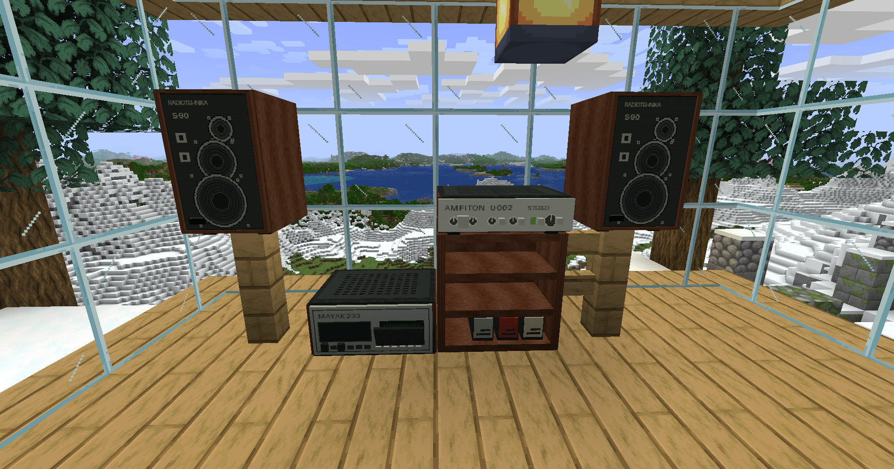

[Русский](README.md) | **English**

# Soviet Hi-Fi for Minecraft 26.2 (Fabric)

Soviet Hi-Fi brings a pair of **Radiotehnika S-90 speakers**, a **Mayak-233 cassette deck**, an **Amfiton U-002 amplifier**, a 12-cassette rack, and recordable cassettes to Minecraft. Record a local MP3 or OGG Vorbis file onto a blank cassette, insert it into the deck, and nearby players will hear it. Sound fades with distance and through walls; the amplifier can add a subtle tape character.

## Installation

Requires **Minecraft 26.2**, **Java 25**, **Fabric Loader 0.19.3+**, and **Fabric API 0.160.0+26.2**. Download [Soviet Hi-Fi 0.3.0](release/soviet-hi-fi-fabric-0.3.0.jar) and place the JAR and matching Fabric API in the `mods` folder on **both the server and every client**. This JAR does not run on Forge.

## How to play

1. Craft two S-90 speakers, a Mayak deck, an Amfiton amplifier, and a blank cassette using the [recipe image](docs/crafting-guide.png). Blank cassettes stack to 64; recorded ones do not stack.
2. Place the deck within **2 blocks** of the amplifier and both speakers within **4 blocks** of the amplifier. To combine deck and amplifier in one block space, right-click the top of one with the other in hand. Either order works.
3. Hold a blank cassette, right-click, and choose a local MP3 or OGG Vorbis file. A track may be up to **16 MB and 6 minutes** long. Keep holding the cassette until recording finishes. The audio uploads to the server and is delivered automatically to listeners.
4. Right-click the deck with a recorded cassette, then right-click the deck to open its controls and play. Adjust shared volume and tape effect there; each listener also has a personal volume setting. Eject from the controls or with Shift + right-click using an empty hand.
5. The rack stores up to **12 cassettes**. Right-click it with a cassette to insert one, or with an empty hand to open the selection screen.

Tracks are stored with the world in `soviet-hifi/tracks`. Keep that folder when moving the world. Only record audio you have the right to use; this repository contains no third-party songs.

## Crafting and building

The image above shows all five recipes. Any wooden planks or wooden slabs work; the metal nugget is an iron nugget. The S-90 recipe yields **two speakers**. Combining the deck and amplifier happens by placing them in the world.

Run `./build.ps1` from PowerShell to build and test the mod. Set `JAVA_HOME` to a Java 25 installation, or let the script use the Minecraft Launcher Java 25 runtime if available. The JAR appears in `build/libs`. Two decoder tests use optional local audio fixtures in `demo/` and are skipped when those files are absent. See the [0.3.0 verification notes](docs/verification-2026-09-21.md).

Before downgrading, break combined deck/amplifier blocks because earlier versions do not recognize `soviet_hifi:stereo_stack`. Migration of an existing Forge world to Fabric has not been tested separately.
