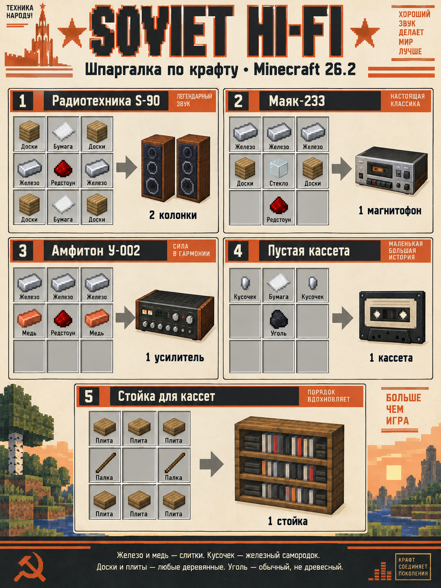

# Soviet Hi-Fi for Minecraft 26.2 (Fabric)

[Русский](#русский) · [English](#english)

## Русский

Soviet Hi-Fi добавляет в Minecraft пару колонок **Радиотехника S-90**, кассетную деку **Маяк-233**, усилитель **Амфитон У-002**, стойку для 12 кассет и сами кассеты. Запиши на пустую кассету свой MP3 или OGG Vorbis, вставь её в деку — и музыку услышат игроки поблизости. Громкость убывает с расстоянием и за стенами; настройки усилителя позволяют добавить мягкий кассетный характер звучания.

### Установка

Нужны **Minecraft 26.2**, **Java 25**, **Fabric Loader 0.19.3+** и **Fabric API 0.160.0+26.2**. Скачай [Soviet Hi-Fi 0.3.0](release/soviet-hi-fi-fabric-0.3.0.jar) и положи JAR вместе с подходящим Fabric API в папку `mods` **сервера и каждого клиента**. На Forge этот JAR не запускается.

### Как пользоваться

1. Скрафти две S-90, Маяк, Амфитон и пустую кассету по [картинке с рецептами](docs/crafting-guide.png). Пустые кассеты складываются по 64; записанные хранятся по одной.
2. Поставь деку не дальше **2 блоков** от усилителя, а две колонки не дальше **4 блоков** от усилителя. Можно поставить усилитель прямо на деку или деку на усилитель: нажми ПКМ по верхней стороне уже установленного прибора с другим прибором в руке.
3. Возьми пустую кассету в руку, нажми ПКМ и выбери MP3 или OGG Vorbis на своём компьютере. Ограничение: **16 МБ и 6 минут** на трек. Подожди окончания записи, удерживая кассету в руке. Файл загрузится на сервер; другим игрокам отдельно загружать его не нужно.
4. Нажми ПКМ записанной кассетой по деке, затем открой деку ПКМ и включи воспроизведение. Там же регулируются общая громкость и эффект ленты; у каждого игрока есть личная регулировка. Кассету можно извлечь через окно или Shift+ПКМ пустой рукой.
5. Стойка хранит до **12 кассет**. Нажми по ней кассетой, чтобы положить её; пустой рукой открой список и выбери кассету.

Музыка хранится в папке мира `soviet-hifi/tracks` и передаётся клиентам через сервер. Для переноса мира сохрани эту папку вместе с миром. Записывай только те треки, которые вправе использовать; в репозиторий чужая музыка не включена.

### Крафты

Картинка выше показывает все пять рецептов. `Доски` — любые деревянные доски, `Плита` — любая деревянная плита, `Кусочек` — железный самородок. Рецепт S-90 сразу даёт **две колонки**. Сочетание деки и усилителя происходит при установке в мире; отдельного рецепта у него нет.

### Сборка из исходников

Запусти `./build.ps1` в PowerShell. Скрипт использует установленный Java 25; если `JAVA_HOME` не задан, он попробует Java 25 из Minecraft Launcher. Результат появится в `build/libs`. Для разработки используются Gradle 9.5.1 и Fabric Loom 1.17.21. Проверки версии 0.3.0 описаны в [журнале проверки](docs/verification-2026-09-21.md).

При возврате на старую версию сначала разбери совмещённую деку с усилителем: старые версии не знают блок `soviet_hifi:stereo_stack`. Перенос существующего Forge-мира на Fabric отдельно не проверялся.

## English

Soviet Hi-Fi brings a pair of **Radiotehnika S-90 speakers**, a **Mayak-233 cassette deck**, an **Amfiton U-002 amplifier**, a 12-cassette rack, and recordable cassettes to Minecraft. Record a local MP3 or OGG Vorbis file onto a blank cassette, insert it into the deck, and nearby players will hear it. Sound fades with distance and through walls; the amplifier can add a subtle tape character.

### Installation

Requires **Minecraft 26.2**, **Java 25**, **Fabric Loader 0.19.3+**, and **Fabric API 0.160.0+26.2**. Download [Soviet Hi-Fi 0.3.0](release/soviet-hi-fi-fabric-0.3.0.jar) and place the JAR and matching Fabric API in the `mods` folder on **both the server and every client**. This JAR does not run on Forge.

### How to play

1. Craft two S-90 speakers, a Mayak deck, an Amfiton amplifier, and a blank cassette using the [recipe image](docs/crafting-guide.png). Blank cassettes stack to 64; recorded ones do not stack.
2. Place the deck within **2 blocks** of the amplifier and both speakers within **4 blocks** of the amplifier. To combine deck and amplifier in one block space, right-click the top of one with the other in hand. Either order works.
3. Hold a blank cassette, right-click, and choose a local MP3 or OGG Vorbis file. A track may be up to **16 MB and 6 minutes** long. Keep holding the cassette until recording finishes. The audio uploads to the server and is delivered automatically to listeners.
4. Right-click the deck with a recorded cassette, then right-click the deck to open its controls and play. Adjust shared volume and tape effect there; each listener also has a personal volume setting. Eject from the controls or with Shift + right-click using an empty hand.
5. The rack stores up to **12 cassettes**. Right-click it with a cassette to insert one, or with an empty hand to open the selection screen.

Tracks are stored with the world in `soviet-hifi/tracks`. Keep that folder when moving the world. Only record audio you have the right to use; this repository contains no third-party songs.

### Crafting and building

The image above shows all five recipes. Any wooden planks or wooden slabs work; the metal nugget is an iron nugget. The S-90 recipe yields **two speakers**. Combining the deck and amplifier happens by placing them in the world.

Run `./build.ps1` from PowerShell to build and test the mod. Set `JAVA_HOME` to a Java 25 installation, or let the script use the Minecraft Launcher Java 25 runtime if available. The JAR appears in `build/libs`. See the [0.3.0 verification notes](docs/verification-2026-09-21.md).

Before downgrading, break combined deck/amplifier blocks because earlier versions do not recognize `soviet_hifi:stereo_stack`. Migration of an existing Forge world to Fabric has not been tested separately.

